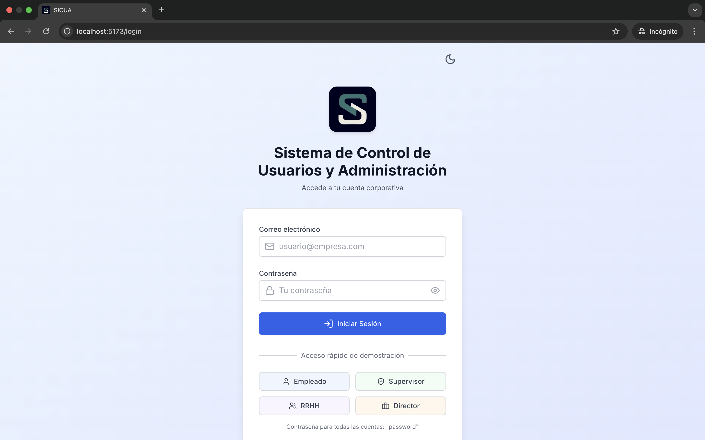
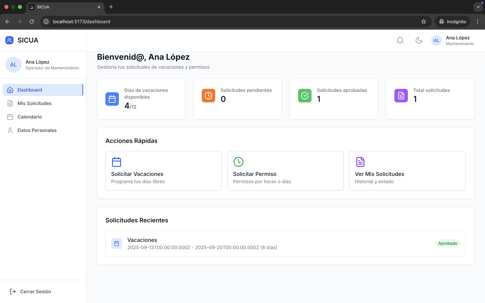
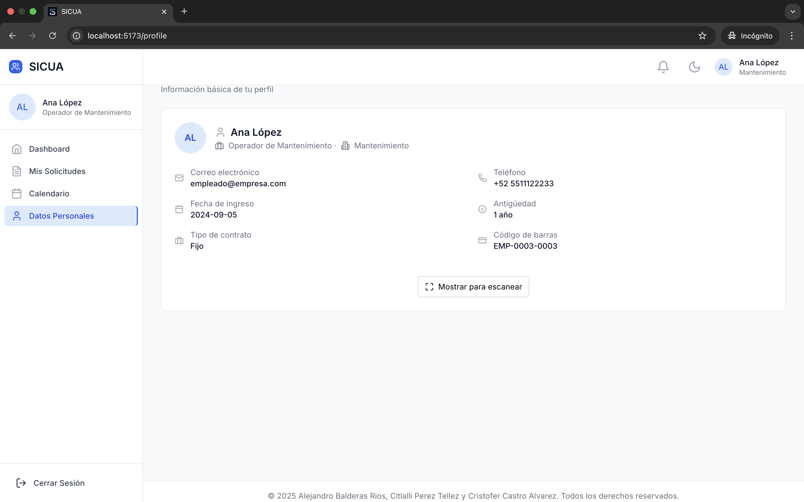
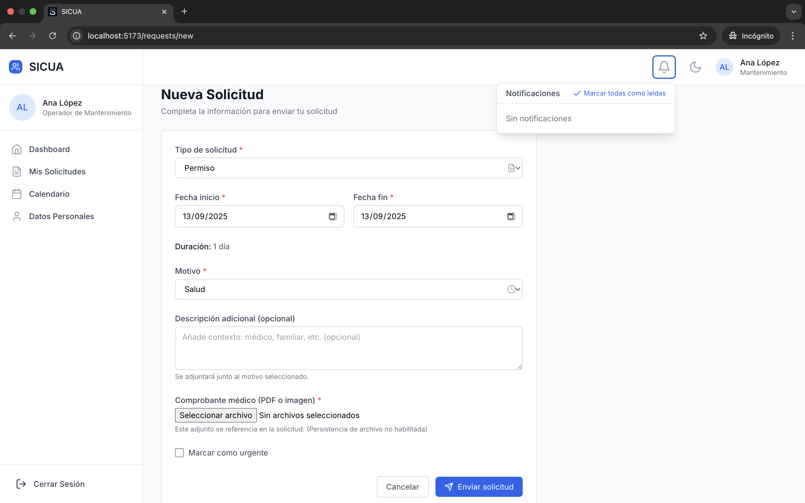
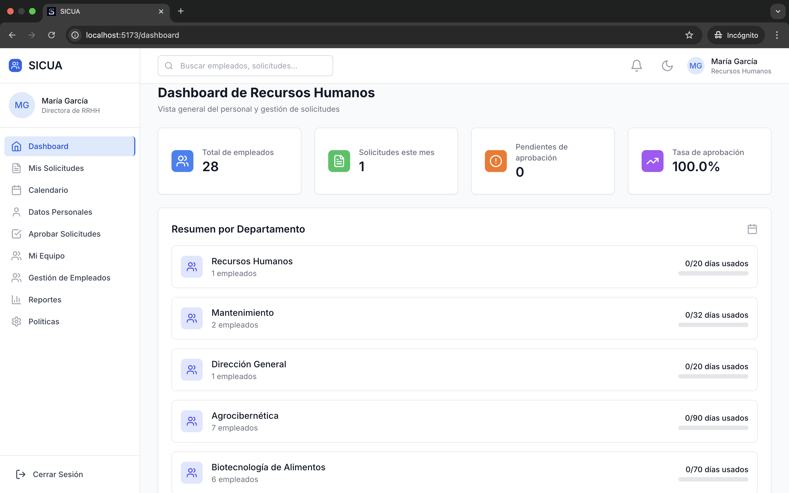
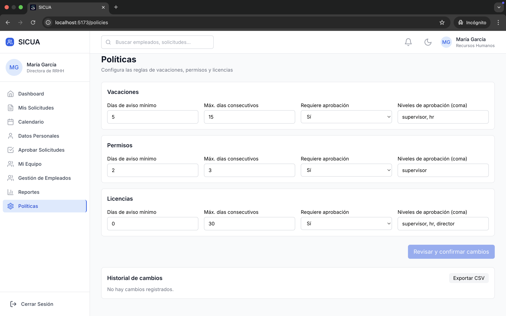

# 🚀 SICUA – Sistema de Control de Usuarios y Administración

Aplicación **full-stack** para la gestión de **usuarios, solicitudes y políticas**.  
Frontend: **Vite + React + TypeScript + TailwindCSS**  
Backend: **Express + Prisma**  

  
  
  


---

## 📑 Índice
- [📦 Requisitos](#-requisitos)  
- [⚡ Quick Start](#-quick-start)  
- [🏗️ Build & Producción](#️-build--producción)  
- [📂 Estructura del Proyecto](#-estructura-del-proyecto)  
- [🔑 Variables de entorno](#-variables-de-entorno)  
- [🗄️ Base de datos (Prisma + SQLite)](#️-base-de-datos-prisma--sqlite-por-defecto)  
- [🖥️ Desarrollo](#️-desarrollo)  
- [🛠️ Scripts útiles](#️-scripts-útiles)  
- [🚀 Despliegue en Producción](#-despliegue-en-producción)  
- [🐞 Troubleshooting](#-troubleshooting)  
- [📖 Documentación](#-documentación)  
- [📸 Capturas](#-capturas)  
- [👥 Créditos](#-créditos)  

---

## 📦 Requisitos
- Node.js **18+**
- npm **9+**

---

## ⚡ Quick Start
```bash
# 1) Variables de entorno
echo 'VITE_API_URL=http://localhost:3001' > .env
mkdir -p server && echo 'DATABASE_URL="file:./dev.db"\nPORT=3001' > server/.env

# 2) Instalar dependencias
npm install && (cd server && npm install)

# 3) Inicializar base de datos
cd server && npm run prisma:generate && npm run prisma:migrate && npm run prisma:seed && cd ..

# 4) Ejecutar frontend y backend
(cd server && npm run dev) & npm run dev
```

👉 También puedes usar el **script automatizado**:
```bash
npm run setup   # configura todo
npm run dev:all # inicia backend + frontend juntos
```

---

## 🏗️ Build & Producción
```bash
# Compilar frontend y backend
npm run build:all

# Iniciar ambos en modo producción
npm run start:all
```
⚠️ Asegúrate de que `VITE_API_URL` en `.env` apunte al backend correcto antes de compilar.

---

## 📂 Estructura del Proyecto
```
.
├── src/                 # Frontend (Vite + React + TS)
│   ├── app/             # Layout, Providers
│   ├── features/        # auth, dashboard, requests, reports...
│   ├── shared/          # services, utils, data, components
│   └── main.tsx         # Punto de entrada
│
└── server/              # Backend (Express + Prisma)
    ├── src/index.ts     # Servidor principal
    ├── prisma/schema.prisma
    ├── prisma/dev.db    # SQLite por defecto
    └── prisma/seed.ts   # Datos iniciales
```

---

## 🔑 Variables de entorno
Frontend (`.env`):
```env
VITE_API_URL=http://localhost:3001
```

Backend (`server/.env`):
```env
DATABASE_URL="file:./dev.db"
PORT=3001
```

---

## 🗄️ Base de datos (Prisma + SQLite por defecto)
**Opción A (recomendada)** – Re-crear BD con migraciones + seed:
```bash
cd server
npm run prisma:generate
npm run prisma:migrate
npm run prisma:seed
```

**Opción B** – Usar `server/prisma/dev.db` ya versionado:
```bash
cd server
npm run prisma:generate
```

---

## 🖥️ Desarrollo
Backend:
```bash
cd server && npm run dev    # http://localhost:3001
```

Frontend:
```bash
npm run dev                 # http://localhost:5173
```

---

## 🛠️ Scripts útiles
- **Frontend**: `npm run dev`, `npm run build`
- **Backend**:
  - `npm run dev` → servidor en desarrollo
  - `npm run build && npm start` → producción
  - `npm run prisma:generate` → regenerar cliente Prisma
  - `npm run prisma:migrate` → aplicar migraciones
  - `npm run prisma:seed` → poblar datos iniciales

---

## 🚀 Despliegue en Producción
- Se recomienda usar **Postgres** en lugar de SQLite.
- Ajusta `provider = "postgresql"` en `schema.prisma`.
- Configura `DATABASE_URL` en el servidor destino.
- Usa secretos de tu proveedor (Railway, Render, Vercel, VPS).

---

## 🐞 Troubleshooting
- **API not configured** → revisa `.env` y reinicia Vite.
- **Cambios en Prisma** → ejecuta `prisma:generate` y `prisma:migrate`.
- **Puerto en uso** → cambia `PORT` en `server/.env`.

---

## 📖 Documentación
- [📄 Setup detallado](docs/SETUP.md)
- [📝 Changelog](docs/CHANGELOG.md)

---

## 📸 Capturas

<div align="center">

  

  
  
  
  
  
  

</div>

---

## 👥 Créditos
© **2025** Alejandro Balderas Rios, Citlalli Perez Teller y Cristofer Castro Alvares.  
Todos los derechos reservados.  
